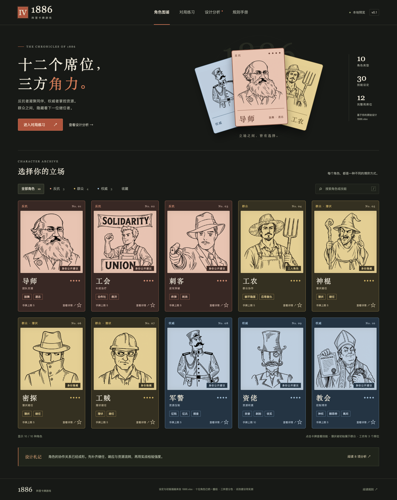

# 安那其1886卡牌游戏

十位角色、三个阵营的卡牌游戏展示与规则分析，包含统一风格角色插画和双人基础牌练习。

## 打开完整页面

[在线体验：安那其1886卡牌游戏](https://zhishiren.github.io/ananqi-1886-card-game/#roster)

下载仓库后，双击根目录的 `index.html`，即可体验完整页面。也可在仓库目录运行 `python3 -m http.server 1887`，然后访问 http://127.0.0.1:1887/#roster 。

在线页面由 GitHub Pages 托管。Gitee 仓库首页展示截图并保存代码；部署方式见 [部署文档](DEPLOYMENT.md)。

## 项目文件

- `index.html`、`styles.css`、`app.js`：页面结构、样式和交互，保留现有代码注释。
- `data.js`、`review-data.js`：角色、技能与规则审读数据。
- `assets/`：当前十张统一画风插画和历史版本。
- `previews/`：桌面端、移动端、详情与练习界面截图。
- 各设计记录 `.md`：角色重绘、统一画风与本地快照说明。

## 本地预览与规则说明

双击同目录的 `index.html` 即可打开。页面不依赖网络、账户或外部字体；移动整个文件夹时，请保留 `assets`、`data.js`、`review-data.js`、`app.js` 和 `styles.css`。

当前运行的本地地址是 http://127.0.0.1:1886 。服务关闭后，仍可双击 `index.html` 使用。

页面包含四部分：

- 角色图鉴：10 种角色、阵营和技能搜索、收藏、完整技能原文及试改建议。
- 对局练习：双人基础牌演示，可以攻击、响应防、治疗、决斗、摸牌和弃牌。
- 设计分析：8 项规则与平衡性审读，每项附原稿位置及处理建议。
- 规则手册：基础牌、胜利条件、席位、牌堆建议、30 个技能原文和斗防点数演示。

分析以 `1886.xlsx` 的“角色与技能表”为主。`Sheet1` 中已有的建议稿只作为参考，未自动覆盖原始设定。没有改动原工作簿。

原稿共 10 种角色，工农有 3 个席位，因此完整名单合计 12 人。30 个技能包括基础技、角色技、通用技和联合技。所有角色生命上限为 4，资佬手牌上限为 10，其余为 5。

## 优先判断

1. “贪婪”和“剥削”重复，且其他技能又将“剥削”视为取牌行为，应先补独立效果。
2. 最后一名权威死亡时，继任与判胜的先后会改变结果。建议先完成存活潜伏者继任，再检查胜负。保留原稿中反抗方需要保护至少一名真实工农的目标。
3. 按防点数不小于斗的比较规则，防 2 不能抵挡任何普通斗。炸弹产生的虚拟斗也缺少点数。
4. 征税虽然最多保留 4 张，仍可能让大量其他玩家失牌；赎罪券的全场交牌或失血也随人数放大。应测试目标人数上限。
5. 导师、工会、刺客的定位及主要触发代价可以保留。工会的治疗转换频率值得记录，暂不把群体收益直接等同于失衡。

这是一轮规则审读，尚无实战胜率数据。页面中的“试改建议”不是经过验证的最终规则。

## 练习范围

练习使用两副去王扑克牌，共 104 张；双方预设为 3/4 生命，各持 6 张手牌，便于直接体验。后续每回合摸 2 张，结束回合弃到 5 张。

角色技能、掩护、联合技、身份继任、多人救援、距离与正式阵营胜负尚未接入练习。A 在练习中仅治疗自己。决斗按双方各出一张斗、低者受伤、同点无伤、无斗算 0 处理。体力降到 0 时结束该次练习，没有正式濒死窗口。

初版插画来自原工作簿内的 10 张独立图片，按画面推定角色对应。

工会插画已按你的反馈重新设计：自然的人物面部、工装背带裤与卷袖衬衫，上方条幅为英文“SOLIDARITY”，保持黑白线稿、举拳姿势和 UNION 讲台。上一轮版本为 `assets/union-v3.png`，原图 `assets/union.png` 和上一版 `assets/union-v2.png` 保留供回看。

教会插画已重绘为负面讽刺风格的虚构教权人物：傲慢自得的表情、华丽教袍与高冠，一手展示赎罪券，一手紧攥钱袋，表现虚伪和贪婪。赎罪券标题为英文“INDULGENCE”。上一轮图片为 `assets/church-v2.png`；原图 `assets/church.png` 保留供回看。

收藏仅保存在当前浏览器，练习局面在刷新后重置。

## 当前插画版本：统一画风 v1

十位角色现均使用 `assets/角色ID-unified-v1.png`。以资佬为主参考统一复古钢笔线条：重点重画工农、神棍、密探、工贼、军警；导师和教会减少细密排线；刺客、工会与资佬保留主要形象。工会保留工装和英文条幅，教会保留负面讽刺神态。

反抗：锈红（纸色 #e9c5b3）；群众：赭黄（纸色 #e5d095）；权威：灰蓝（纸色 #bfcfdf）。神棍、密探、工贼按初始群众阵营着色。

首页、图鉴、详情和练习头像均读取同一角色插画数据。旧图未删除。完整图片清单及内置生成工具的提示词见 [统一插画设计记录](unified-art-design.md)。
